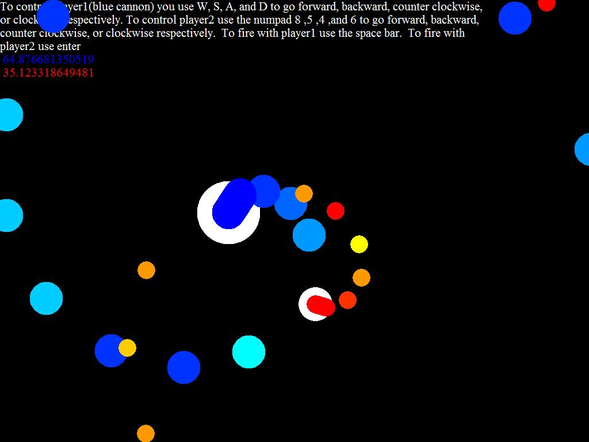



## A  \+\(Rotation Tanks, MadGamer\)\+  A

### Description

This is a very fun tank game that allows you to shot and move in any direction. Code is very well documented and I&#8217;m sure that anyone can learn a lot about how to use Sin and Cos with VB for rotation and movement. Please leave me comments and vote. If you have any questions please leave me a comment and I will be quick to leave you a response. Thanks to all who check out my game-MadGamer
 
### More Info
 

             |
---                |---
**Submitted On**   |2005-10-16 12:57:00
**By**             |[RapidPix](https://github.com/Planet-Source-Code/PSCIndex/blob/master/ByAuthor/rapidpix.md)
**Level**          |Advanced
**User Rating**    |4.0 (8 globes from 2 users)
**Compatibility**  |VB 5\.0, VB 6\.0
**Category**       |[Games](https://github.com/Planet-Source-Code/PSCIndex/blob/master/ByCategory/games__1-38.md)
**World**          |[Visual Basic](https://github.com/Planet-Source-Code/PSCIndex/blob/master/ByWorld/visual-basic.md)
**Archive File**   |[A\_\_\+\(Rotat19409010162005\.zip](https://github.com/Planet-Source-Code/rapidpix-a-rotation-tanks-madgamer-a__1-62918/archive/master.zip)

